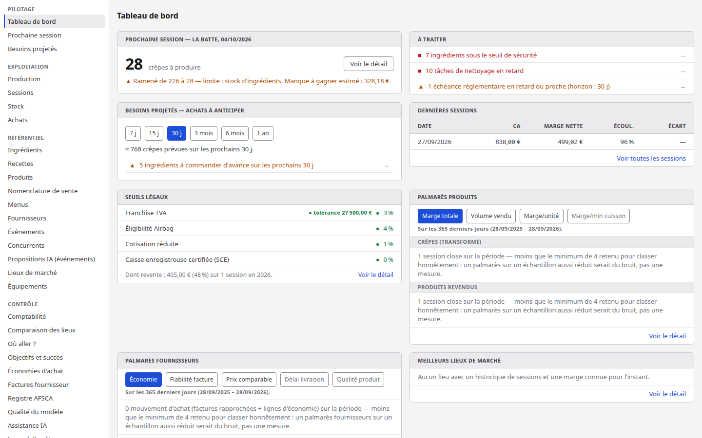
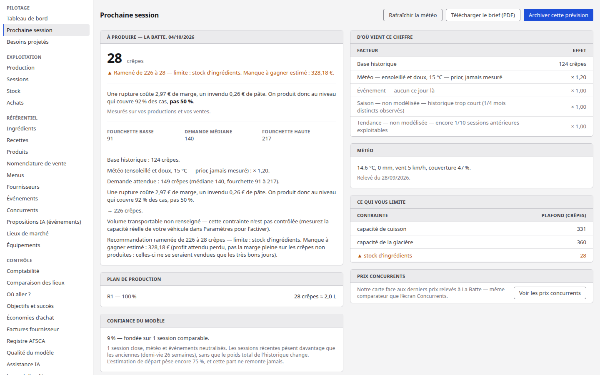
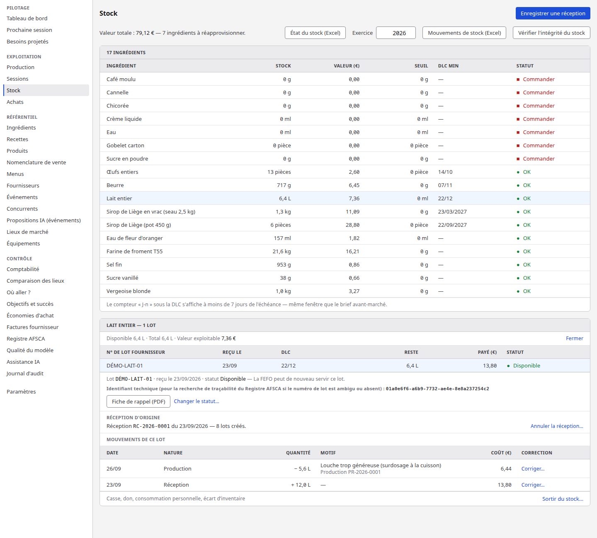
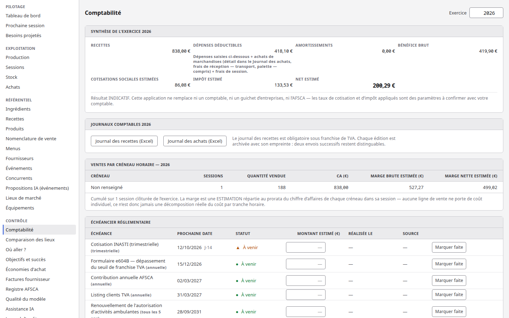
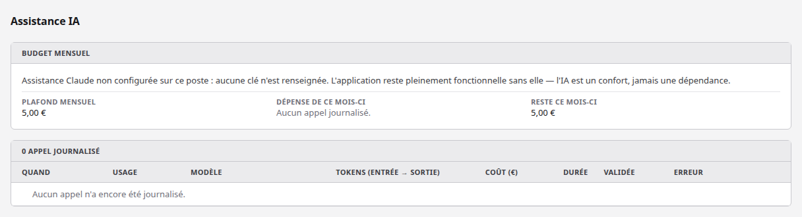

# Batte

[](https://github.com/warrox1993/batte/actions/workflows/ci.yml)

Batte est une application de gestion (un petit ERP) pour un stand de crêpes ambulant : recettes,
stock par lots, prévision de production, ventes, comptabilité et registre sanitaire, dans un seul
outil local. Un agent Claude y commente les chiffres et cherche sur le web les événements qui
peuvent changer la fréquentation d'un marché.

Je l'ai conçue pour mon propre projet de stand de crêpes, en indépendant complémentaire, au marché
de La Batte à Liège (d'où le nom). Deux personnes, un poste, une saisie avant et après chaque
marché. L'application tourne sur le PC, sans hébergement ni abonnement, et les données restent sur
le poste. Seuls des services optionnels passent par le réseau : la météo (Open-Meteo, gratuit),
Claude et le calcul d'itinéraire.

Jean-Baptiste Dhondt, développeur full stack à Liège.

## Captures d'écran

Prises avec Chromium headless sur la base de démonstration (`npm run db:seed:demo`) : toutes les
données sont fictives.

Tableau de bord : prochaine session, seuils légaux, tâches en retard, dernières sessions.



Prochaine session : la recommandation de production et le détail de son calcul (base
historique, facteur météo, contraintes de stock, de cuisson et de glacière).



Stock : chaque ingrédient, ses lots avec leur DLC, et les mouvements d'un lot (réception,
consommation par une production).



Comptabilité : synthèse de l'exercice, journaux exportables en Excel, échéancier réglementaire.



Assistance IA : plafond mensuel, dépense du mois et journal des appels. Ici sans clé d'API :
l'application le dit et continue de fonctionner.



## Ce que fait l'application

| Domaine         | Contenu                                                                                       |
| --------------- | --------------------------------------------------------------------------------------------- |
| Recettes        | Fiches techniques versionnées, rendements, allergènes, coût matière                           |
| Achats et stock | Réceptions par lot, DLC, consommation FEFO, point de commande, bons de commande par mail      |
| Prévision       | Nombre de crêpes à produire selon l'historique, la météo (Open-Meteo) et les événements       |
| Ventes          | Sessions de marché, clôture (caisse, invendus, températures), marge par session               |
| Comptabilité    | Recettes, dépenses, amortissements, seuils légaux belges (franchise TVA, etc.), exports Excel |
| Qualité (AFSCA) | Relevés de température, plan de nettoyage, traçabilité des lots, registre PDF                 |
| Documents       | PDF (fiches techniques, brief avant-marché, registre) rendus par Chromium via Playwright      |

## Architecture

Monorepo npm, TypeScript strict partout.

| Paquet          | Rôle                                                                                           |
| --------------- | ---------------------------------------------------------------------------------------------- |
| `packages/core` | Logique métier pure : calculs, moteur de prévision, contrats Zod. Aucun accès disque ni réseau |
| `packages/db`   | Schéma SQLite (Drizzle ORM), 31 migrations, dépôts et services transactionnels                 |
| `apps/api`      | Serveur Fastify 5 : routes HTTP, documents PDF et Excel, mail, client Claude                   |
| `apps/web`      | Interface React 19 + Vite 7 + Tailwind CSS 4, un écran par tâche, utilisable au clavier        |

Les choix qui structurent le code :

- Toute la logique chiffrée vit dans `packages/core`, en fonctions pures et testées. Un composant
  React ou une route Fastify ne calcule pas une marge.
- Les montants sont des entiers en centimes d'euro, les masses en grammes, les volumes en
  millilitres. Aucun flottant pour de l'argent ; une conversion volume/masse passe par la densité
  déclarée de l'ingrédient.
- Le stock n'est jamais modifié directement : il est la somme de ses mouvements (réception,
  production, casse, correction). L'historique reste auditable, ce que demande l'AFSCA.
- Rien ne s'efface : une erreur se corrige par une écriture d'annulation, et les tables sensibles
  ont un journal d'audit.
- Zod valide toutes les frontières : corps HTTP, réponses du serveur côté interface, fichiers
  importés, réponses de Claude.
- Les seuils, taux et coefficients réglementaires sont des paramètres en base, avec leur source et
  leur date de validité, jamais des constantes dans le code.
- Une valeur inconnue s'affiche comme inconnue (un tiret), jamais comme un zéro.
- En production, un seul processus Fastify sert l'API et l'interface sur `127.0.0.1`. La base est
  un fichier SQLite, sauvegardé à chaque démarrage (`VACUUM INTO`).

Les spécifications et le journal des 98 décisions d'architecture sont dans [`docs/`](docs/).

## L'IA dans Batte

Le principe tient en une phrase : **l'IA commente, les chiffres viennent d'un calcul classique.**
Le moteur de prévision est écrit en TypeScript, déterministe et explicable (chaque facteur est
affiché, voir la deuxième capture). Claude ne produit aucun nombre qui entre en base.

Ce que fait Claude, via `@anthropic-ai/sdk`, uniquement côté serveur :

- Commentaires : il rédige un court commentaire de la prévision, du brief avant-marché et de
  l'écart entre prévu et réalisé d'une session close. Chaque consigne lui interdit de produire un
  chiffre : il cite ceux que le moteur lui transmet. Le serveur recalcule lui-même la prévision
  avant de la faire commenter, pour qu'aucun appelant ne fasse commenter des chiffres inventés.
- Découverte d'événements, en agent avec recherche web : pour un lieu et un rayon donnés, Claude
  utilise l'outil serveur `web_search` d'Anthropic pour trouver des événements réels et sourcés
  (braderies, matchs, travaux, fériés locaux) et les rendre avec leur source. La boucle reprend
  sur `pause_turn` : au plus 3 tours de 5 recherches, le plafond étant revérifié à chaque tour. La
  réponse doit se terminer par un bloc JSON validé par un schéma Zod ; une réponse mal formée est
  refusée et rien n'est proposé.
- Validation humaine : les événements trouvés arrivent comme propositions en attente.
  L'utilisateur ajuste l'intensité et la portée estimées, puis valide ou rejette. L'impact sur la
  prévision est calculé ensuite par l'application, jamais par le modèle.

Les garde-fous :

- Plafond de coût : un plafond mensuel (paramètre, 5 € par défaut) est vérifié avant chaque
  appel, sur le coût maximal possible de cet appel (entrée estimée et plafond de sortie). Si ce
  coût peut le dépasser, l'appel n'a pas lieu.
- Journal : chaque appel est enregistré dans `journal_ia` avec son usage, son modèle, ses tokens,
  son coût réel (tokens et recherches web facturées), sa durée et son erreur éventuelle.
- Mode sans IA : sans clé `ANTHROPIC_API_KEY`, avec un plafond atteint ou en cas de panne,
  chaque écran reste utilisable et annonce simplement que le commentaire est indisponible. La clé
  ne quitte jamais le serveur.
- Modèles paramétrables : Claude Haiku 4.5 pour la recherche d'événements, Claude Sonnet 5 pour
  les commentaires. Les identifiants et les tarifs sont des paramètres en base, modifiables sans
  toucher au code (statut et prix vérifiés dans la documentation Anthropic le 28/09/2026).
- Tests sans réseau : les tests font parler le vrai SDK à un faux serveur local
  (`ANTHROPIC_BASE_URL`) ou à une adresse morte, avec une clé factice. Aucune suite n'appelle l'API.

Non implémenté : la lecture automatique d'un bon de livraison par l'IA était prévue, elle n'a pas
été construite. Les valeurs correspondantes du schéma sont documentées comme réservées.

## Démarrage rapide

Prérequis : Node.js 22 ou plus récent. Aucune base de données à installer.

```bash
npm install
npm run db:init        # crée la base, applique les migrations, insère les paramètres
npm run db:seed:demo   # facultatif : données de démonstration, jamais sur une base réelle
npm start              # construit l'interface et lance l'application
```

Puis ouvrir <http://127.0.0.1:3001>. En développement, `npm run dev` lance l'API sur `:3001` et
Vite sur `:5173`.

Aucune configuration n'est obligatoire. Pour activer Claude ou l'envoi de mails, copier
`.env.example` en `.env` et renseigner les clés. Le guide complet (sauvegarde, restauration,
dépannage) est dans [`docs/UTILISATION.md`](docs/UTILISATION.md).

## Tests et qualité

Mesure du 28/09/2026 :

- 4 848 tests dans 265 fichiers, tous verts, en une minute environ sur mon poste : fonctions
  pures du cœur, services SQLite, routes Fastify, écrans React montés dans jsdom avec Testing
  Library, rendu PDF réel par Chromium. Il ne reste aucun test `it.fails` : les 13 défauts
  connus qu'ils décrivaient (double envoi par Ctrl+S, focus perdu, message de
  confirmation invisible, sortie clavier manquante) ont été corrigés à la source.
- Couverture (v8, Vitest 4) : 85,6 % des lignes sur l'ensemble du code, 99,8 % des lignes et
  97,5 % des branches sur `packages/core`.
- `npm audit` : 0 vulnérabilité connue, dépendances de développement comprises.
- L'intégration continue GitHub Actions rejoue à chaque pull request : vérification des types,
  ESLint, Prettier, installation de Chromium, construction de l'interface, puis Vitest (un test
  vérifie que le serveur de production sert bien l'interface construite).

```bash
npm run typecheck
npm run lint
npm run format:check
npx vitest run           # ou npm run test:couverture
npm run build
```

## Limites assumées

- Mono-utilisateur et local : pas de comptes, pas de droits, pas de synchronisation entre postes.
  Le serveur n'écoute que `127.0.0.1`.
- Interface pensée pour un écran d'ordinateur (1280 px et plus), en français uniquement.
- Le moteur de prévision démarre à froid : tant que peu de sessions réelles sont enregistrées, il
  s'appuie sur des valeurs a priori et l'affiche.
- La lecture d'un bon de livraison par l'IA n'est pas implémentée.
- L'application aide à tenir les obligations (seuils, registre, échéances), elle ne remplace ni un
  comptable ni l'AFSCA ; les écrans concernés le rappellent.

## Méthode

Batte a été développée en pilotant Claude Code, pas en lui déléguant le projet. Concrètement :

- des spécifications écrites avant le code (modules, modèle de données, moteur de prévision,
  parcours d'écran) et un découpage en lots ([`docs/01`](docs/01-SPEC-FONCTIONNELLE.md) à
  [`docs/06`](docs/06-UI-ET-PARCOURS.md)) ;
- un contexte permanent pour l'agent, [`CLAUDE.md`](CLAUDE.md), qui fixe les règles
  d'architecture non négociables et les garde-fous ;
- chaque décision non triviale consignée avec ses options et ses conséquences
  ([`docs/05-DECISIONS.md`](docs/05-DECISIONS.md)) ;
- des audits ciblés relus et arbitrés un par un (erreurs, sécurité, comptabilité, clavier,
  allergènes : `docs/08` à `docs/40`), et une doctrine qui recense les défauts réellement
  rencontrés et la façon de les éviter ([`docs/39`](docs/39-DOCTRINE-DES-AGENTS.md)) ;
- les tests comme preuve : un défaut connu est d'abord décrit par un test `it.fails`, et une
  mutation volontaire du code vérifie qu'un test sait bien échouer.

## Structure du dépôt

```text
apps/api        serveur Fastify, documents, client Claude
apps/web        interface React
packages/core   logique métier pure et contrats Zod
packages/db     schéma Drizzle, migrations, services
docs/           spécifications, décisions, audits, guide d'utilisation
.claude/        fiches d'agents et commandes utilisées pendant le développement
```

## Licence

MIT, voir [`LICENSE`](LICENSE).
